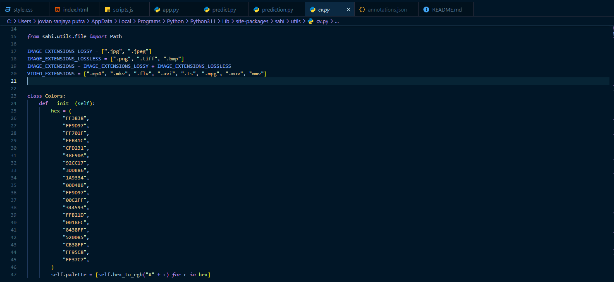
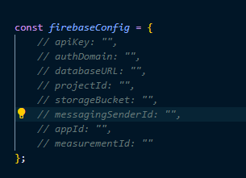

# Internship YoloV11 Web Application 

The project is web application for OIS Metal Defect AI Edge Detection 

## Prerequisites

- Python 3.6 or higher installed on your system.
- Git for cloning the repository

## Setup Instructions

### 1. Clone the Repository

If you haven't already, clone the repository using:

```bash
git clone https://github.com/JovianSanjaya/Internship_YoloV11_Web.git
cd Internship Project YoloV11 Web
```

### 2. Create Virtual Environment and Activate

```bash 
python -m venv venv
venv\Scripts\activate
```

### 3. Install Dependencies
```bash 
pip install -r requirements.txt
```

### 4. Run Flask Application
```bash 
python app.py
```

---
## Useful Information

### 1. object_detection 
This folder contains the models. The latest model is train_model.pt

### 2. templates
This folder contains the html folder. The html files need to be in this folder to be accessed when using Flask

### 3. stitching
this folder contains everything related to the stitching. more information about the stitching can be found here https://github.com/OpenStitching/stitching

### 4. chatbot
This folder contains everything related about the chatbot
- chat_model.keras : This is the AI chatbot model
- intent.json : This file usually contains a collection of intents, which are predefined categories representing different user inputs. It may include patterns (sample phrases) and responses for each intent.
- tokenizer.pickle : Used to convert text into a numerical format (tokens) that can be fed into a machine learning model.
- label_encoder.pickle : Converts categorical labels (such as tag or context in the intents) into numerical values.

## 5. static
This folder contains the images used, javascript, and css files. For now, only the ai chatbot used Tailwind CSS while the other page use vanilla CSS which is stated in style.css

## 6. changing color of the prediction
find the cv.py file
just change the first four colours



## 7. Firebase API
Put your firebase api under scripts.js


By Jovian